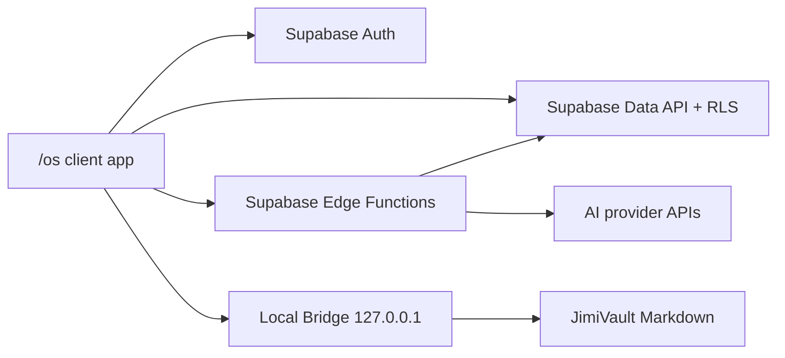

# Technical Architecture

Last updated: 2026-06-29

## Hosting Model

The portfolio remains a Next.js App Router project with `output: "export"` and deploys to GitHub Pages through the existing workflow. The OS is implemented as a client-side protected SPA under `/os`.

Next.js static export does not support cookies, middleware, Server Actions, request-dependent Route Handlers, or unbounded dynamic routes. All dynamic OS behavior uses browser code plus Supabase APIs, Edge Functions, and the optional Local Bridge.

## Frontend

- Framework: Next.js 16, React 19, Tailwind CSS 4.
- Auth/data client: `@supabase/supabase-js`.
- Validation: `zod`.
- Icons: `lucide-react`.
- Env vars:
  - `NEXT_PUBLIC_SUPABASE_URL`
  - `NEXT_PUBLIC_SUPABASE_ANON_KEY`
  - `NEXT_PUBLIC_OS_OWNER_EMAIL` defaults to `jimiaki7@gmail.com`
  - `NEXT_PUBLIC_OS_BRIDGE_URL` defaults to `http://127.0.0.1:3737`

All Supabase client initialization must tolerate missing env vars so `npm run build` succeeds in GitHub Actions.

## Supabase

Supabase owns authentication, private data, Edge Functions, and future scheduled jobs.

Tables:

- `profiles`
- `sources`
- `memory_items`
- `memory_edges`
- `projects`
- `tools`
- `agent_runs`
- `agent_steps`
- `artifacts`
- `insights`
- `approval_requests`
- `cost_events`

Every table has `owner_id uuid not null`. RLS policies use `auth.uid() is not null and auth.uid() = owner_id`.

## Edge Functions

Initial functions:

- `os-chat`: authenticated model orchestration placeholder.
- `memory-search`: server-side memory search placeholder.
- `agent-run`: creates controlled run records and requires approval for external actions.
- `dream-scan`: produces suggested insights.
- `source-sync`: accepts Bridge-synced metadata.

AI provider secrets and `service_role` keys live only in Supabase secrets or local Bridge config, never in browser code.

## Local Bridge

The Bridge is a local-only process at `127.0.0.1`.

Endpoints:

- `GET /health`
- `POST /vault/search`
- `POST /vault/read`
- `POST /vault/sync`
- `POST /proposal/write-note`

The Bridge requires a local bearer token, allows only configured origins, defaults to read-only, and excludes sensitive Vault paths such as `重要データ.md`.

## Data Flow

## Failure Strategy

- Missing Supabase env: show setup state.
- Supabase error: keep local UI alive and report the failing module.
- Bridge offline: disable Vault actions, preserve dashboard.
- Edge Function unavailable: show proposed prompt/action locally instead of executing.
